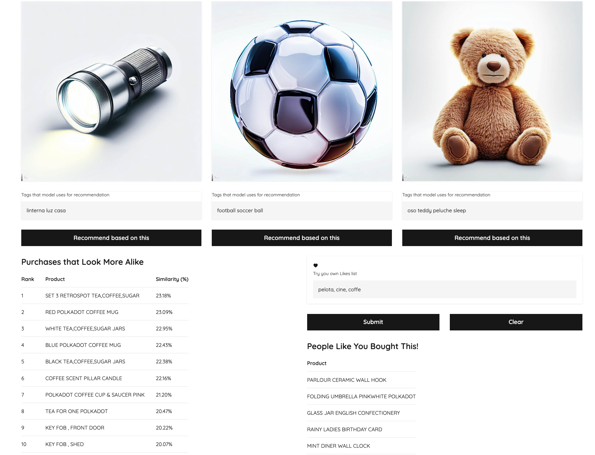

# recommend-demo

## Simple Recommendation System with DBSCAN/KMEANS

### Introduction

Welcome to our simple recommendation system example! In this demonstration, we'll explore how embeddings and the DBSCAN+KMEANS hybrid system can be used to create a basic recommendation system.

### How It Works

Our recommendation system starts by using embeddings, which are vector representations of items based on their features. Items with similar features have embeddings that are close in the vector space. We'll use these embeddings to measure the similarity between items.

Next, we'll apply the DBSCAN clustering algorithm to group similar items together based on their embeddings. DBSCAN identifies clusters of items that are densely connected. These clusters will serve as our recommendation groups.

When a user interacts with an item, we'll calculate its embedding and find the cluster it belongs to. Then, we'll recommend other items from the same cluster to the user.

### Try It Out

Feel free to explore our recommendation system by interacting with different items. Click on an item to see recommendations from the same cluster! You can also experiment by providing your own set of likes.

### Get Started

To get started, implement the embedding calculation and DBSCAN+KMEANS clustering in your backend. You can then use the resulting clusters to make recommendations to users based on their interactions.

